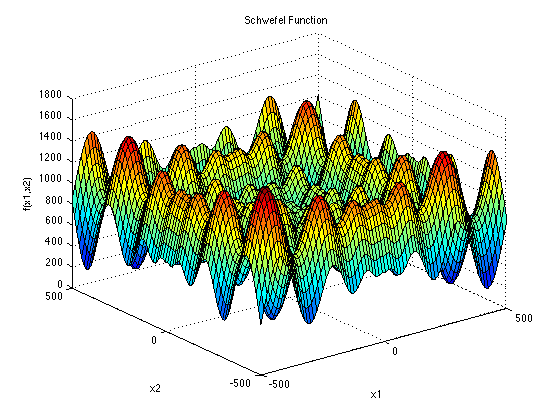

# CSCI596PROJECT: Optimization Algorithms Visualization on Schwefel Function

## Project Description

This Python project visualizes the behavior of various optimization algorithms on the Schwefel Function, a well-known complex mathematical function used in optimization and computational intelligence research. The project compares the performance and search patterns of four distinct algorithms: [Particle Swarm Optimization (PSO)](https://github.com/HanxiangLiu/CSCI596PROJECT#particle-swarm-optimization-pso), [Genetic Algorithm (GA)](https://github.com/HanxiangLiu/CSCI596PROJECT#genetic-algorithm-ga), [Ant Colony Optimization (ACO)](https://github.com/HanxiangLiu/CSCI596PROJECT#ant-colony-optimization-aco), and [Artificial Bee Colony (ABC)](https://github.com/HanxiangLiu/CSCI596PROJECT#artificial-bee-colony-abc).


### Schwefel Function




[The Schwefel Function](https://www.sfu.ca/~ssurjano/schwef.html) is a non-convex function used as a performance test problem for optimization algorithms. It is complex due to its large number of local minima, making it difficult for optimization algorithms to find the global minimum. The function is mathematically defined as:


where `d` is the dimension of the search space. The function has a global minimum at `x_i = 420.9687` for all `i` in a d-dimensional space.

## Algorithms

### Particle Swarm Optimization (PSO)

[Particle Swarm Optimization (PSO)](https://en.wikipedia.org/wiki/Particle_swarm_optimization) simulates the behaviors of bird flocking. It optimizes a problem by iteratively trying to improve a candidate solution with regard to a given measure of quality.

### Genetic Algorithm (GA)

[Genetic Algorithm (GA)](https://en.wikipedia.org/wiki/Genetic_algorithm) is a search heuristic that mimics the process of natural selection. This heuristic (also sometimes called a metaheuristic) is routinely used to generate useful solutions to optimization and search problems.

### Ant Colony Optimization (ACO)

[Ant Colony Optimization (ACO)](https://en.wikipedia.org/wiki/Ant_colony_optimization_algorithms) is inspired by the foraging behavior of some ant species. These ants deposit pheromone on the ground in order to mark some favorable path that should be followed by other members of the colony.

### Artificial Bee Colony (ABC)

[Artificial Bee Colony (ABC)](https://en.wikipedia.org/wiki/Artificial_bee_colony_algorithm) is an optimization algorithm based on the intelligent foraging behavior of a honey bee swarm.

## Usage

Run the `main.py` script to initialize the algorithms with predefined parameters. The script animates the movement of each algorithm's agents (particles, ants, bees, etc.) in the search space, exploring the Schwefel Function's landscape to find the minima.

```bash
python main.py

```

## Results

The visualization results are stored in the `result/` directory, where each iteration's state is captured as an image. The visual comparison provides insights into how each algorithm navigates the complex landscape of the Schwefel Function.

## Dependencies

-   Python 3
-   NumPy
-   Matplotlib

## License

This project is only used for CSCI596 Class.